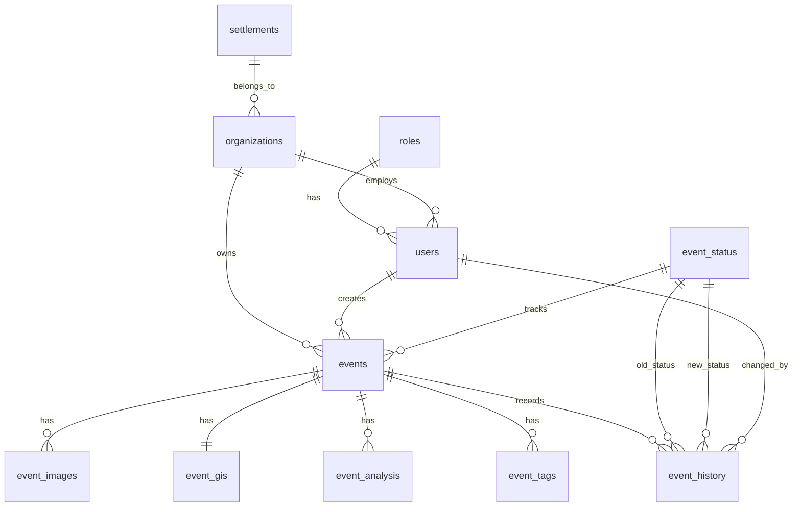

# PrioritAI — Project Architecture Guide

> **Goal of this document:** A developer or partner who has never seen this codebase should be able to locate any piece of logic within 5 minutes.

---

## Table of Contents

1. [System Overview](#1-system-overview)
2. [Directory Tree](#2-directory-tree)
3. [Backend — `/server`](#3-backend--server)
4. [Frontend — `/client`](#4-frontend--client)
5. [Data Flow: End-to-End Request](#5-data-flow-end-to-end-request)
6. [Role Model](#6-role-model)
7. [Priority Score Formula](#7-priority-score-formula)
8. [How to Add a New Feature](#8-how-to-add-a-new-feature)
9. [Running the Project](#9-running-the-project)
10. [Database Architecture](#10-database-architecture)

---

## 1. System Overview

PrioritAI is a **rocket damage prioritization system** used by three tiers of municipal authorities (Super Admin, Admin, Operator). When a field operator photographs a damaged building, the system:

1. Classifies the damage severity using a **Keras CNN model** (Heavy / Light)
2. Runs a **GIS pipeline** (OpenStreetMap + CBS demographics) to measure proximity to hospitals, schools, roads, military sites, and population density
3. Computes a **priority score** (0–10) using a weighted piecewise formula
4. Returns the event to the dashboard ranked by urgency

**Stack:** FastAPI (Python) · React + TypeScript · Leaflet maps · Zustand state · Docker + Nginx

---

## 2. Directory Tree

```
Rocket-Damage-Prioritization-System/
│
├── docker-compose.yml          # Orchestrates backend + frontend containers
├── uploads/                    # Uploaded damage images (persisted via bind-mount)
│   ├── tel_aviv_heavy_1.jpg
│   ├── jerusalem_heavy_1.jpg
│   └── ...                     # 20 seed images + any user-uploaded files
│
├── server/                     # Python FastAPI backend
│   ├── Dockerfile
│   ├── requirements.txt
│   ├── seed_events.json        # Pre-computed seed data (20 events with real GIS scores)
│   ├── data/                   # CBS demographic shapefiles + Excel population data
│   │   ├── statistical_areas.shp
│   │   └── population_2022.xlsx
│   ├── tests/                  # Integration + unit tests
│   └── src/                    # All application code (see §3)
│
└── client/                     # React + TypeScript frontend
    ├── Dockerfile
    ├── nginx.conf              # Nginx reverse-proxy config (for Docker deployment)
    ├── public/
    │   └── test-images/        # Images used by the "test templates" in the Add Event form
    └── src/                    # All application code (see §4)
```

---

## 3. Backend — `/server`

### 3.1 Source tree

```
server/src/
│
├── main.py                         # FastAPI app factory + lifespan startup
│
├── api/
│   └── routes/
│       ├── auth.py                 # POST /auth/login · GET /auth/users
│       ├── organizations.py        # GET|POST /organizations · GET /settlements
│       ├── events.py               # POST /events · GET /events · GET /events/{id}
│       ├── analyze.py              # POST /analyze  (raw pipeline, used by tests)
│       └── health.py               # GET /health
│
├── core/
│   ├── ai_logic.py                 # Keras model loader + inference
│   ├── priority_logic.py           # Piecewise scoring formula
│   └── rocket_damage_model.keras   # Trained CNN weights (tracked via Git LFS)
│
├── schemas/
│   ├── event.py                    # EventResponse Pydantic model
│   └── analysis.py                 # AnalysisResponse Pydantic model
│
├── services/
│   ├── ai_service.py               # Thin wrapper: calls ai_logic, returns dict
│   ├── gis_service.py              # Thin wrapper: calls gis_pipeline, returns dict
│   ├── priority_service.py         # Thin wrapper: calls priority_logic + explanation builder
│   └── gis/
│       ├── gis_pipeline.py         # Orchestrates all 5 GIS sub-queries + coordinate cache
│       ├── demographics/
│       │   └── population_density.py   # CBS shapefile lookup (preloaded at startup)
│       └── proximity/
│           ├── osm_query.py            # Overpass API wrapper with fallback endpoints
│           ├── closest_hospital.py
│           ├── closest_school.py
│           ├── closest_road.py
│           └── closest_military_base.py
│
├── seed_db.py                      # CLI script: populates DB (settlements, orgs, users, events)
└── seed_data.py                    # CLI script: runs GIS for 20 events → seed_events.json
```

### 3.2 Key files explained

| File | What it does |
|---|---|
| `main.py` | Creates the FastAPI app. On startup: loads the Keras model, preloads CBS population data, and loads `seed_events.json` into the in-memory event store. Mounts `/uploads` as a static directory. |
| `api/routes/events.py` | Owns the in-memory `_event_store` dict. `POST /events` runs AI classification immediately and queues GIS as a `BackgroundTask`. `GET /events` returns all events sorted by priority. `GET /events/{id}` is polled by the frontend to detect when GIS finishes. |
| `api/routes/analyze.py` | Legacy endpoint used by integration tests. Runs the full AI+GIS+priority pipeline synchronously and returns raw intermediate values. |
| `core/ai_logic.py` | Loads `rocket_damage_model.keras` once at startup (via `preload_model()`). `run_inference(image_bytes)` preprocesses the image and returns `{"classification": "Heavy"|"Light", "damage_score": 7|3}`. |
| `core/priority_logic.py` | Contains `calculate_piecewise_value(distance)` and `get_final_priority_score(damage_score, gis_features)`. The formula is `clamp(damage_score × (1 + S_total), 0.1, 10.0)` where `S_total` is a weighted sum of 5 GIS coefficients. |
| `services/gis/gis_pipeline.py` | Calls all five proximity functions in sequence and the population density lookup. Caches results by rounded coordinates `(lat±0.001°, lon±0.001°)` to avoid duplicate Overpass queries. |
| `services/gis/proximity/osm_query.py` | Wraps `osmnx.features_from_point()` with retry logic and automatic failover to two backup Overpass API endpoints if the primary returns HTTP 429. |
| `services/gis/demographics/population_density.py` | Joins CBS statistical-area shapefiles to population Excel data at startup (`preload_population_data()`). Returns people/km² for any coordinate via a spatial point-in-polygon lookup. |
| `seed_data.py` | Standalone CLI script. Defines 20 raw event locations, runs each through the full GIS+priority pipeline, and writes the result to `server/seed_events.json`. Run with: `python -m server.src.seed_data` |

---

## 4. Frontend — `/client`

### 4.1 Source tree

```
client/src/
│
├── main.tsx                    # React DOM entry point
├── App.tsx                     # Router + role-based route guards
├── index.css                   # Global Tailwind base styles
│
├── config/
│   ├── api.ts                  # API_BASE_URL constant (reads VITE_API_URL env var)
│   └── testTemplates.ts        # Pre-filled event scenarios for the Add Event form
│
├── types/
│   └── index.ts                # All shared TypeScript interfaces and enums
│                               # (DamageEvent, User, Organization, EventStatus, UserRole…)
│
├── store/
│   └── authStore.ts            # Three Zustand stores: Auth, Event, Notification
│                               # Event store holds all events client-side after backend fetch
│
├── hooks/
│   └── index.ts                # useAuth() — reads from authStore, exposes user + logout
│
├── utils/
│   └── helpers.ts              # Pure formatting functions:
│                               # formatDate, formatScore, getPriorityLabel,
│                               # getPriorityColor, getInitials, truncateText
│
├── pages/
│   ├── auth/
│   │   └── Login.tsx           # Login form with demo credential presets
│   │
│   ├── admin/
│   │   ├── Dashboard.tsx       # Admin overview: stats cards + map + event table
│   │   ├── EventsPage.tsx      # Full event list with filters, heatmap toggle, hide/show
│   │   ├── UserManagement.tsx  # Create / edit / deactivate users; expandable event brief
│   │   └── ModelRunner.tsx     # Manual image upload → raw AI+GIS pipeline test
│   │
│   ├── operator/
│   │   ├── OperatorDashboard.tsx   # Operator's org-scoped dashboard
│   │   ├── NewEventForm.tsx        # Main event submission form; polls GIS status
│   │   └── FieldMapView.tsx        # Full-screen map view for field use
│   │
│   ├── super-admin/
│   │   └── OrgManagement.tsx   # Lists all organizations; live event/user stats; create org
│   │
│   └── UserProfile.tsx         # User profile + settings page
│
├── components/
│   ├── layout/
│   │   ├── Sidebar.tsx         # Navigation sidebar; role-aware menu items
│   │   ├── Navbar.tsx          # Top bar: notifications dropdown + user menu
│   │   └── PageContainer.tsx   # Wraps every page with scroll area + Navbar
│   │
│   ├── events/
│   │   ├── EventTable.tsx      # Sortable/searchable event table; role-aware columns
│   │   ├── EventDetailView.tsx # Full event detail card: image, GIS panel, explanation
│   │   ├── EditEventModal.tsx  # Modal form (react-hook-form + zod) to edit name/desc/tags
│   │   └── AIExplanationBox.tsx # Renders the llmExplanation text with formatting
│   │
│   ├── maps/
│   │   ├── MapContainer.tsx    # Leaflet map; supports "pins" and "heatmap" modes
│   │   ├── EventMarker.tsx     # Colored circle marker; click opens event detail
│   │   └── LocationPicker.tsx  # Draggable pin used in the NewEventForm to pick coordinates
│   │
│   └── ui/                     # Reusable design-system primitives
│       ├── Badge.tsx           # Status / severity pill
│       ├── Button.tsx          # Primary / ghost / danger / outline variants
│       ├── Card.tsx            # White card container with optional header slot
│       ├── Input.tsx           # Labeled text input with error state
│       └── Modal.tsx           # Accessible dialog with backdrop
```

### 4.2 Key files explained

| File | What it does |
|---|---|
| `App.tsx` | Defines all routes. `ProtectedRoute` checks authentication and `allowedRoles`. On mount, restores session from `localStorage`. `RootRedirect` sends each role to its home page. |
| `store/authStore.ts` | Three independent Zustand stores. **AuthStore** holds the logged-in user and org. **EventStore** is the single source of truth for all events in the UI — every dashboard reads from it. **NotificationStore** manages the bell dropdown. |
| `pages/operator/NewEventForm.tsx` | Submits a `multipart/form-data` POST to `/events`. After the backend responds (with `gisStatus: "pending"`), the component polls `GET /events/{id}` every 4 seconds until `gisStatus` becomes `"done"`, then calls `updateEvent()` in the store. |
| `config/api.ts` | Exports `API_BASE_URL`. In local dev this is `http://localhost:8000`; in Docker it is `/api` (proxied by Nginx). All `fetch()` calls in the app use this constant. |
| `types/index.ts` | Single source of truth for all types. `DamageEvent` is the central interface. `UserRole` (`SUPER_ADMIN`, `ADMIN`, `OPERATOR`) and `EventStatus` (`PENDING`, `IN_PROGRESS`, `COMPLETED`) are the key enums used for access control and filtering. |

---

## 5. Data Flow: End-to-End Request

### Submitting a new event (happy path)

```
[Operator fills NewEventForm]
        │
        ▼
POST /events  (multipart: image + lat/lon/description/org)
        │
        ├─► AI classification  (≈100 ms)
        │      ai_logic.py → damage_score = 7 (Heavy) or 3 (Light)
        │
        ├─► Save image to /uploads/{event_id}.jpg
        │
        ├─► Return event immediately  ◄── gisStatus: "pending"
        │      Frontend shows spinner
        │
        └─► BackgroundTask: _run_gis_and_update()
               │
               ├─► gis_pipeline.py
               │      ├── closest_hospital.py   (Overpass API via osm_query.py)
               │      ├── closest_school.py
               │      ├── closest_road.py
               │      ├── closest_military_base.py
               │      └── population_density.py (CBS shapefile, preloaded)
               │
               ├─► priority_logic.py
               │      final_score = clamp(damage_score × (1 + S_total), 0.1, 10)
               │
               └─► _event_store[event_id].update(score, gisDetails, gisStatus="done")

[Frontend polls GET /events/{id} every 4s]
        │
        └─► gisStatus == "done"  →  updateEvent() in Zustand store
                                    Dashboard re-renders with real score
```

### Loading the dashboard

```
Dashboard / EventsPage mounts
        │
        ▼
fetch GET /events
        │
        ├─ 200 OK + data  →  setEvents(data)  →  all views update
        └─ Network error  →  empty list / UI error (no mock fallback)
```

---

## 6. Role Model

| Role | Home Page | Can Do |
|---|---|---|
| `SUPER_ADMIN` | `/super-admin/organizations` | View all orgs + all events; manage all users |
| `ADMIN` | `/admin/dashboard` | View org events; manage org users; hide/show events; change status |
| `OPERATOR` | `/operator/dashboard` | Create events; edit own events; view org events |

Route guards are enforced in `App.tsx` via `<ProtectedRoute allowedRoles={[...]}>`. The sidebar in `Sidebar.tsx` also hides links the current role cannot access.

---

## 7. Priority Score Formula

```
final_score = clamp( damage_score × (1 + S_total) , 0.1 , 10.0 )

S_total = w₁·C_hospital + w₂·C_school + w₃·C_road + w₄·C_military + w₅·C_density

Weights (w):  hospital=0.30  school=0.15  road=0.20  military=0.20  density=0.15

Piecewise coefficient C for each distance d:
  d ≤ 5 km      →  C =  (5000 - d) / 5000        (bonus: closer = higher)
  5–10 km       →  C =  0.0                        (neutral zone)
  10–15 km      →  C = -(d - 10000) / 5000         (penalty: more isolated)
  d > 15 km     →  C = -1.0                        (maximum isolation penalty)
  d = -1 (N/F)  →  C = -1.0                        (not found = worst case)
```

The formula is implemented in `server/src/core/priority_logic.py`.

---

## 8. How to Add a New Feature

### New API endpoint

1. Create or edit a route file in `server/src/api/routes/`
2. Register the router in `server/src/main.py` via `app.include_router(...)`
3. Add a Pydantic schema in `server/src/schemas/` if the response shape is new

### New GIS data source

1. Add a new module in `server/src/services/gis/proximity/` (follow the pattern of `closest_hospital.py`)
2. Call it inside `server/src/services/gis/gis_pipeline.py` → `extract_gis_features()`
3. Add its weight and piecewise coefficient in `server/src/core/priority_logic.py` → `get_final_priority_score()`

### New frontend page

1. Create the page component in `client/src/pages/<role>/MyPage.tsx`
2. Add the route in `client/src/App.tsx` inside `<AppRoutes>` with the appropriate `allowedRoles`
3. Add the nav link in `client/src/components/layout/Sidebar.tsx` with the matching `roles` array

### New shared UI component

1. Add it to `client/src/components/ui/` (keep it stateless and prop-driven)
2. Import directly where needed — no central re-export required

---

## 9. Running the Project

### Local development

```bash
# Backend (from repo root)
python -m server.src.main

# Frontend (from /client)
npm install
npm run dev
```

### Docker (production)

```bash
docker-compose up --build
# Frontend: http://localhost:5173
# Backend:  http://localhost:8000
# API docs: http://localhost:8000/docs
```

### Populate the database (full seed)

```bash
# 1. Run migrations first (creates tables and reference data)
psql -U prioritai -d prioritai -f server/migrations/001_init_schema.sql

# 2. Populate all tables: settlements, organizations, users, events
python -m server.src.seed_db
```

This seeds:
- **Settlements**: Tel Aviv, South, Jerusalem
- **Organizations**: Tel Aviv Municipality, South Authority, Jerusalem Municipality (each linked to a settlement)
- **Users**: Super admins (haimgalata@gmail.com, linoysahalo@gmail.com), admins, operators — all with password `1234`
- **Events**: 20 events from `seed_events.json` with full AI + GIS data, images, tags, and history

Idempotent: safe to run multiple times; skips existing data.

### Re-generate seed_events.json (optional)

```bash
# Runs full GIS pipeline for all 20 events and writes seed_events.json
python -m server.src.seed_data
# Then run seed_db again to load the fresh events
```

### Demo login credentials (password: 1234)

| Role | Email |
|---|---|
| Super Admin | haimgalata@gmail.com |
| Super Admin | linoysahalo@gmail.com |
| Super Admin | sarah@prioritai.gov |
| Admin | david@tel-aviv.gov |
| Operator | miriam@tel-aviv.gov |

---

## 10. Database Architecture

### 10.1 Overview

PrioritAI is a **rocket damage prioritization system** used by municipal authorities. The database persists all damage events, organizations, users, and associated metadata.

**What the database is used for:**

- Stores damage events with geographic coordinates, descriptions, and status
- Holds AI classification results (damage score, priority score, explanations)
- Stores GIS-derived features (distances to hospitals, schools, roads, military sites; population density)
- Maintains organizations, users, and their relationships
- Records status change history for audit purposes

The database replaces the previous in-memory store and provides persistence across restarts.

### 10.2 Database Structure

| Table | Purpose | Main Columns | PK | FKs |
|-------|---------|--------------|-----|-----|
| `settlements` | Geographic areas (cities/regions) | id, name, settlement_code | id | — |
| `roles` | User role lookup (super_admin, admin, operator) | id, name | id | — |
| `event_status` | Event lifecycle (new, in_progress, done) | id, name | id | — |
| `organizations` | Municipal authorities | id, name, settlement_id, external_id, created_at | id | settlements.id |
| `users` | System users | id, name, email, password, role_id, organization_id, external_id, created_at | id | roles.id, organizations.id |
| `events` | Damage event records | id, lat, lon, address, city, description, organization_id, created_by, status_id, hidden, created_at | id | organizations.id, users.id, event_status.id |
| `event_images` | Event image URLs | id, event_id, image_url | id | events.id |
| `event_gis` | GIS features per event (1:1) | id, event_id, distance_hospital, distance_school, distance_road, distance_military, population_density, geo_multiplier, created_at | id | events.id |
| `event_analysis` | AI damage score and explanation | id, event_id, damage_score, damage_classification, priority_score, explanation, ai_model, created_at | id | events.id |
| `event_tags` | Event tags/categories | id, event_id, tag | id | events.id |
| `event_history` | Status change audit log | id, event_id, old_status_id, new_status_id, changed_by, changed_at | id | events.id, event_status.id (×2), users.id |

### 10.3 Relationships Between Tables

**Reference tables** (no foreign keys): `settlements`, `roles`, `event_status` — used as lookups for other entities.

**Core hierarchy:**

- **Settlement** → one-to-many **Organizations** (each org belongs to one settlement)
- **Organization** → one-to-many **Users** (employs); one-to-many **Events** (owns)
- **Role** → one-to-many **Users** (each user has one role)
- **User** → one-to-many **Events** (as creator via `created_by`)

**Event detail tables** (all reference `events`):

- **Event** → one-to-many **EventImages**
- **Event** → one-to-one **EventGIS**
- **Event** → one-to-many **EventAnalysis** (typically one active analysis per event)
- **Event** → one-to-many **EventTags**
- **Event** → one-to-many **EventHistory**

**EventHistory** links to `event_status` (old and new status) and `users` (who made the change).

### 10.4 ERD Diagram



### 10.5 Example Flow

**Creating an organization, admin, and events:**

1. Insert a **Settlement** (e.g. "Tel Aviv", TAV-001).
2. Insert an **Organization** linked to that settlement (e.g. "Tel Aviv Municipality", external_id: org-1).
3. Insert a **User** with role admin and organization_id → that org (e.g. external_id: user-admin-1).
4. Operator creates an **Event** via `POST /events`: lat, lon, description, organization_id, created_by.
5. Backend inserts **Event**, **EventAnalysis** (AI damage score), **EventImages** (if any), **EventTags**.
6. Background task runs GIS and inserts **EventGIS**, updates **EventAnalysis** with priority score and explanation.
7. When status changes (e.g. new → in_progress), a row is added to **EventHistory**.

### 10.6 Technologies

| Technology | Purpose |
|------------|---------|
| **PostgreSQL 16** | Relational database |
| **SQLAlchemy 2.x** | ORM; models in `server/src/db/models.py` |
| **psycopg2** | PostgreSQL driver |
| **Migration script** | `server/migrations/001_init_schema.sql` — creates tables and seed reference data |
