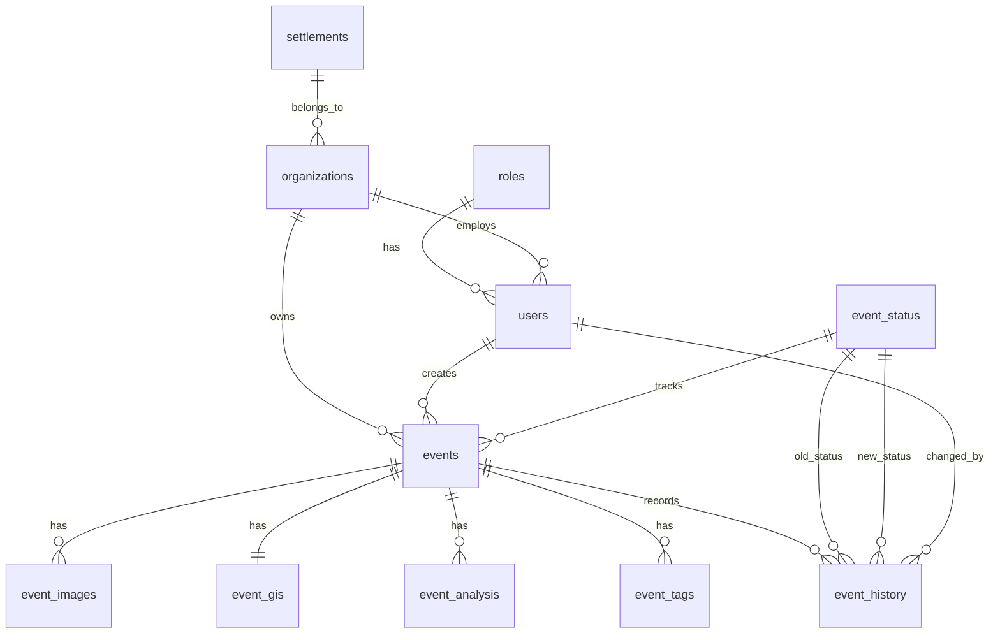

# PrioritAI — Architecture (Developer Guide)

> **Goal:** A developer who is new to the repo can locate logic quickly. For setup and API summary, see [README.md](../README.md).

---

## Table of contents

1. [System overview](#1-system-overview)
2. [Directory tree](#2-directory-tree)
3. [Backend — `server/`](#3-backend--server)
4. [Frontend — `client/`](#4-frontend--client)
5. [ML service — `ml-service/`](#5-ml-service--ml-service)
6. [Data flow: end-to-end request](#6-data-flow-end-to-end-request)
7. [Role model](#7-role-model)
8. [Priority score formula](#8-priority-score-formula)
9. [How to add a new feature](#9-how-to-add-a-new-feature)
10. [Running and seeding](#10-running-and-seeding)
11. [Database architecture](#11-database-architecture)

---

## 1. System overview

PrioritAI is a **rocket damage prioritization system** for municipal authorities (**Super Admin**, **Admin**, **Operator**). When a field operator photographs a damaged building, the system:

1. Sends the image to the **ML microservice** (`POST /predict`) for **Heavy / Light** classification (with a **randomized fallback** if the service is unreachable — not for production reliance).
2. Runs a **GIS pipeline** (OpenStreetMap + CBS demographics) for distances to hospitals, schools, roads, military/strategic sites, and population density.
3. Computes a **priority score** (0–10) using a weighted piecewise formula.
4. Returns the event to the dashboard ranked by urgency.

**Stack:** FastAPI · React + TypeScript · Leaflet · Zustand · Docker Compose + Nginx · PostgreSQL · Supabase Storage (optional) · TensorFlow (ML container only)

---

## 2. Directory tree

```
PrioritAI/
├── docker-compose.yml          # postgres, ml-service, backend, frontend
├── render.yaml                 # Render Blueprint (backend Docker + static frontend)
├── uploads/                    # Runtime paths for legacy/local files; tracked: .gitkeep only
├── ml-service/                 # TensorFlow inference API
│   ├── Dockerfile
│   ├── app/main.py             # GET /health, POST /predict
│   ├── app/inference.py        # Keras load + classify
│   ├── model/                  # rocket_damage_model.keras (Git LFS)
│   └── test_ml/                # Dev smoke scripts
├── server/
│   ├── Dockerfile
│   ├── requirements.txt
│   ├── seed_events.json        # Pre-computed seed events (GIS scores, etc.)
│   ├── data/cbs_data/          # CBS shapefiles + population Excel (Git LFS)
│   ├── tests/
│   └── src/
└── client/
    ├── Dockerfile
    ├── nginx.conf              # SPA + /api proxy to backend
    ├── public/test-images/     # Add Event form test templates
    └── src/
```

---

## 3. Backend — `server/`

### 3.1 Source tree (`server/src/`)

```
server/src/
├── main.py                         # FastAPI app, CORS, /uploads mount, lifespan: CBS preload + init_db
├── api/
│   └── routes/
│       ├── auth.py                 # /auth/*
│       ├── organizations.py        # /organizations, /settlements
│       ├── events.py               # /events
│       ├── analyze.py              # /analyze (sync pipeline, tests / Model Runner)
│       └── health.py               # /health
├── core/
│   ├── ai_fallback.py              # Random Heavy/Light when ML HTTP fails
│   ├── priority_logic.py           # Piecewise scoring + final score
│   └── jwt_tokens.py               # JWT encode/decode (JWT_SECRET)
├── schemas/
│   ├── event.py
│   └── analysis.py
├── services/
│   ├── ai_service.py               # HTTP client → ML_SERVICE_URL /predict
│   ├── event_service.py            # create_event, run_gis_and_update
│   ├── gis_service.py              # Wrapper → gis_pipeline
│   ├── priority_service.py         # Scoring + static / Groq explanations
│   ├── storage/                    # Supabase upload helpers
│   └── gis/
│       ├── gis_pipeline.py         # Parallel GIS + coordinate cache
│       ├── demographics/
│       │   └── population_density.py
│       └── proximity/
│           ├── osm_query.py
│           ├── closest_hospital.py
│           ├── closest_school.py
│           ├── closest_road.py
│           └── closest_military_base.py
├── db/
├── seed_db.py                      # CLI: DB seed (orgs, users, events)
└── seed_data.py                    # CLI: regenerate seed_events.json via GIS
```

### 3.2 Key files

| File | Role |
|------|------|
| `main.py` | App factory. Lifespan: `preload_population_data()`, `init_db()`, seed `event_status` / `roles` if empty. Serves `/uploads`. |
| `api/routes/events.py` | `POST /events`: classification via `ai_service`, optional Supabase image URL, `BackgroundTasks` → `run_gis_and_update`. |
| `api/routes/analyze.py` | Sync AI + GIS + priority for tests and admin Model Runner. |
| `services/ai_service.py` | `run_classification()` → HTTP POST raw bytes to ML service; parses JSON; fallback on errors. |
| `core/priority_logic.py` | `get_final_priority_score`, piecewise distance coefficients, weights. |
| `services/gis/gis_pipeline.py` | Parallel feature extraction, timeouts, in-memory cache by rounded lat/lon. |
| `services/gis/proximity/osm_query.py` | Overpass / osmnx with retries and backup endpoints. |
| `services/gis/demographics/population_density.py` | CBS shapefile + Excel join at startup; point-in-polygon lookup. |
| `seed_data.py` | `python -m server.src.seed_data` → writes `server/seed_events.json`. |

---

## 4. Frontend — `client/`

### 4.1 Source tree (`client/src/`)

```
client/src/
├── main.tsx
├── App.tsx                         # Re-exports ./app/App
├── app/App.tsx                     # Router + ProtectedRoute + role guards
├── index.css
├── config/
│   ├── api.ts                      # VITE_API_URL → API_BASE_URL
│   └── testTemplates.ts
├── types/index.ts
├── store/                          # Zustand: auth, events, notifications
├── hooks/
├── utils/helpers.ts
├── pages/                          # auth, admin, operator, super-admin, UserProfile
└── components/
    ├── layout/
    ├── events/
    ├── maps/
    └── ui/
```

### 4.2 Key files

| File | Role |
|------|------|
| `app/App.tsx` | Routes, `ProtectedRoute`, `allowedRoles`, session restore. |
| `pages/operator/NewEventForm.tsx` | `POST /events`; polls `GET /events/{id}` until `gisStatus` is `done`. |
| `config/api.ts` | `API_BASE_URL`: local `http://localhost:8000`, Docker `/api`. |

---

## 5. ML service — `ml-service/`

| File | Role |
|------|------|
| `app/main.py` | FastAPI: lifespan loads Keras model; `GET /health`; `POST /predict` (raw body); optional `X-API-Key`. |
| `app/inference.py` | Resize 224×224, softmax, map class index → Heavy(7) / Light(3). |

Environment: `MODEL_PATH`, `ML_SERVICE_API_KEY`, `PORT` (default 8080).

---

## 6. Data flow: end-to-end request

### Submitting a new event (happy path)

```
[Operator: NewEventForm]
        │
        ▼
POST /events  (multipart: image + lat/lon/description/org)
        │
        ├─► ai_service.run_classification → POST ML /predict → damage_score
        │
        ├─► Upload image to Supabase Storage (if configured)
        │
        ├─► Return event immediately  ◄── gisStatus: "pending"
        │
        └─► BackgroundTask: run_gis_and_update
               ├─► gis_pipeline (hospital, school, road, military, density)
               ├─► priority_logic + explanation (static or Groq)
               └─► Persist event_gis + event_analysis updates

[Frontend polls GET /events/{id}]
        └─► gisStatus == "done" → update Zustand event store
```

### Loading the dashboard

```
Dashboard mounts → GET /events → event store → tables / maps
```

---

## 7. Role model

| Role | Typical home | Capabilities (summary) |
|------|----------------|-------------------------|
| `SUPER_ADMIN` | Super-admin org UI | Cross-org events and users |
| `ADMIN` | Admin dashboard | Org events, users, hide/show, status |
| `OPERATOR` | Operator dashboard | Create events, org-scoped view |

Enforced in `client/src/app/App.tsx` and `client/src/components/layout/Sidebar.tsx`.

---

## 8. Priority score formula

```
final_score = clamp( damage_score × (1 + S_total) , 0.1 , 10.0 )

S_total = w₁·C_hospital + w₂·C_school + w₃·C_road + w₄·C_military + w₅·C_density

Weights (w):  hospital=0.30  school=0.15  road=0.20  military=0.20  density=0.15

Piecewise coefficient C for distance d (meters):
  d ≤ 5 km      →  C = (5000 - d) / 5000
  5–10 km       →  C = 0.0
  10–15 km      →  C = -(d - 10000) / 5000
  d > 15 km     →  C = -1.0
  d = -1 (N/F)  →  C = -1.0
```

Implementation: `server/src/core/priority_logic.py`.

---

## 9. How to add a new feature

### New API route

1. Add or edit `server/src/api/routes/<name>.py`.
2. Register in `server/src/main.py` with `app.include_router(...)`.
3. Add Pydantic schemas under `server/src/schemas/` if needed.

### New GIS signal

1. Add `server/src/services/gis/proximity/<feature>.py`.
2. Call it from `gis_pipeline.extract_gis_features`.
3. Extend weights / coefficients in `priority_logic.py`.

### New frontend page

1. `client/src/pages/<area>/MyPage.tsx`.
2. Route in `client/src/app/App.tsx` with `allowedRoles`.
3. Nav link in `Sidebar.tsx`.

---

## 10. Running and seeding

### Local (no Compose)

- Backend: `uvicorn server.src.main:app --reload --host 0.0.0.0 --port 8000` (with env vars set; ML service on `ML_SERVICE_URL`).
- Frontend: `cd client && npm ci && npm run dev`.

### Docker Compose

```bash
docker compose up --build
```

Backend receives `ML_SERVICE_URL=http://ml-service:8080` from Compose. Seed:

```bash
docker exec -it prioritai-backend python -m server.src.seed_db
```

Development-only demo users and passwords live in [`server/src/seed_db.py`](../server/src/seed_db.py). **Change or remove them for any public deployment.**

### Regenerate `seed_events.json`

```bash
python -m server.src.seed_data
# then re-run seed_db as needed
```

### Supabase

- `DATABASE_URL` for Postgres; `SUPABASE_URL` / `SUPABASE_KEY` for Storage bucket `event-images`.
- Legacy rows may still reference `/uploads/...` paths.

---

## 11. Database architecture

### 11.1 Overview

PostgreSQL persists events, orgs, users, GIS rows, analysis, tags, and status history. Schema from SQLAlchemy `Base.metadata.create_all` — no Alembic in this repo.

### 11.2 Main tables

| Table | Purpose |
|-------|---------|
| `settlements` | Geographic reference |
| `roles` | super_admin, admin, operator |
| `event_status` | new, in_progress, done |
| `organizations` | Municipal orgs |
| `users` | Accounts |
| `events` | Damage events |
| `event_images` | Image URLs |
| `event_gis` | Distances + density + multiplier |
| `event_analysis` | Damage score, classification, priority, explanation |
| `event_tags` | Tags |
| `event_history` | Status audit |

### 11.3 ERD (high level)



ORM models: `server/src/db/models.py`.

### 11.4 Technologies

| Piece | Technology |
|-------|------------|
| Database | PostgreSQL 16 |
| ORM | SQLAlchemy 2.x |
| Driver | psycopg2 |

---

## Data licenses

CBS statistical data and OpenStreetMap-derived queries have **separate attribution and license obligations**. Document compliance before redistributing shapefiles or derived datasets publicly.
